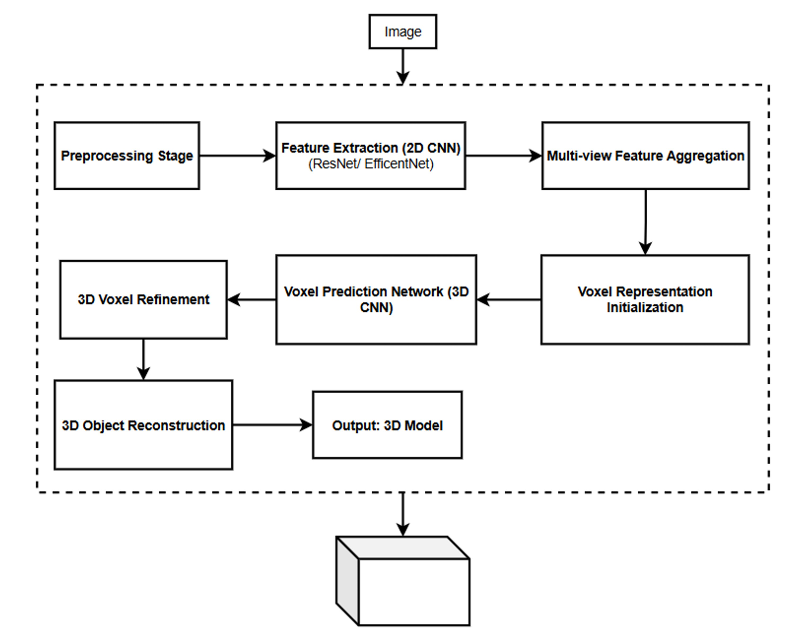
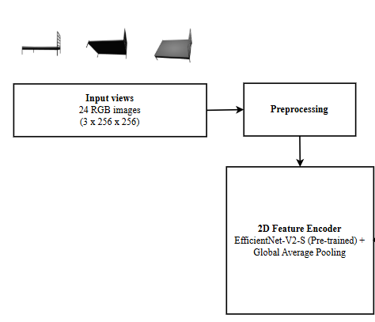
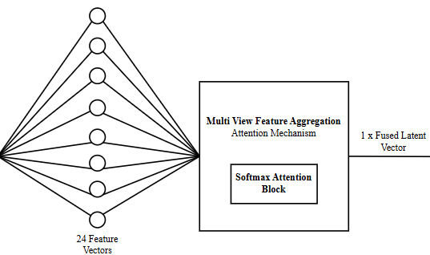
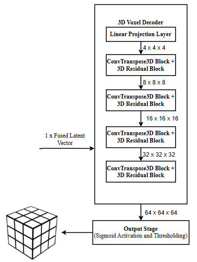
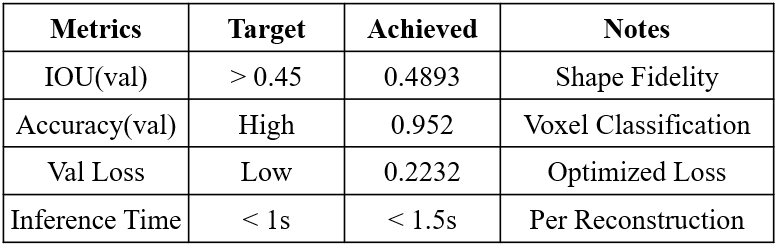
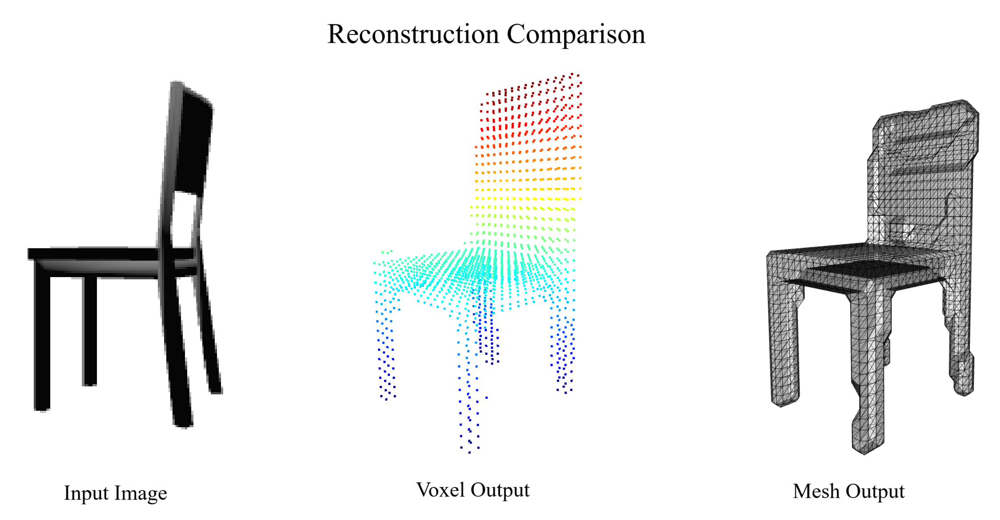

<div align="center">

# 3D Object Reconstruction from Multi-View 2D Imagery

### Attention-Fused Encoder-Decoder Voxel Network

[](https://www.python.org/)
[](https://pytorch.org/)
[](LICENSE)
[](https://ieee.org)

*Accepted at the 1st International Conference on Intelligent Computing, Networks and Security (IC-ICNS 2026)*

**Aaling Jileef Babu · Chinmayi Ajay Rajani · Dharaneesh Kumar · Dr. Venkata Rami Reddy Chirra**  
School of Computer Science and Engineering, VIT-AP University, Amaravati, India

</div>

---

## Overview

This project presents an end-to-end deep learning pipeline for reconstructing 3D occupancy voxel grids from uncalibrated multi-view 2D RGB images. The system combines a pre-trained **EfficientNet-V2-S** 2D feature encoder with a novel **attention-based multi-view fusion module** and a **3D deconvolutional decoder** to predict a 64×64×64 binary voxel grid from 24 input views. The resulting volumetric output is post-processed via **Marching Cubes** to produce a surface mesh ready for 3D visualization.

> **Core Result:** Validation IoU of **0.4893** on the ModelNet dataset — on par with or exceeding comparable encoder-decoder architectures at 64³ resolution.

---

## Architecture



The pipeline consists of three main stages:

**a. 2D Feature Extraction** — Each of the 24 input views is independently processed by a pre-trained EfficientNet-V2-S backbone, producing a 512-dimensional feature vector per view.

**b. Multi-View Attention Fusion** — An attention module computes importance scores for each view via a linear layer + softmax, then produces a single fused latent vector that captures the object's complete shape prior.

**c. 3D Volumetric Upsampling** — A 3D deconvolutional decoder with four upsampling blocks (each followed by a 3D Residual Block) maps the 512-d latent vector to a 64×64×64 occupancy grid.

<table>
<tr>
<td width="50%"></td>
<td width="50%"></td>
</tr>
<tr>
<td align="center"><em>2D Feature Encoder (EfficientNet-V2-S)</em></td>
<td align="center"><em>Multi-View Attention Fusion Module</em></td>
</tr>
</table>



---

## Results

### Quantitative



| Metric | Target | Achieved |
|---|---|---|
| IoU (Val) | > 0.45 | **0.4893** |
| Accuracy (Val) | High | **0.952** |
| Val Loss | Low | **0.2232** |
| Inference Time | < 1s | < 1.5s |

### Qualitative



The model successfully recovers topology-rich shapes. The chair reconstruction (input image → voxel point cloud → Marching Cubes mesh) demonstrates accurate recovery of the seat, backrest, and four legs, with structural integrity well-preserved despite the 64³ resolution limit.

---

## Project Structure

```
reconstructor/
│
├── 1.Dataset Preprocessing/
│   ├── voxelize.py           # Converts OFF/OBJ/PLY meshes → .npy voxel grids (64³)
│   ├── render_views_2.py     # Renders 24 canonical views per model using pyrender
│   ├── preprocessing.py      # Data pipeline utilities
│   └── Person_A.py           # Dataset organisation helper
│
├── 2.Training.py             # Full training loop — model definition, losses, checkpointing
├── 3.Inference_testing.py    # Inference script — loads checkpoint, runs prediction, visualises mesh
│
└── docs/                     # README assets (slide images)
```

---

## Setup & Installation

### Prerequisites

- Python 3.8+
- CUDA-capable GPU (trained on dual NVIDIA T4 on Kaggle)
- [ModelNet](https://modelnet.cs.princeton.edu/) dataset (OFF format)

### Install Dependencies

```bash
pip install torch torchvision torchaudio --index-url https://download.pytorch.org/whl/cu118
pip install trimesh pyrender open3d scikit-image scipy tqdm Pillow numpy
```

> **Note:** `pyrender` requires `OSMesa` for headless rendering. On Linux:
> ```bash
> sudo apt-get install libosmesa6-dev
> PYOPENGL_PLATFORM=osmesa python your_script.py
> ```

---

## Usage

### Step 1 — Preprocess the Dataset

**Voxelise meshes** (converts CAD models to 64³ `.npy` grids):
```bash
python "1.Dataset Preprocessing/voxelize.py" \
    --mesh-root /path/to/ModelNet \
    --out-root  /path/to/ModelNet_out \
    --resolutions 64
```

**Render multi-view images** (produces 24 PNG views per model):
```bash
python "1.Dataset Preprocessing/render_views_2.py" \
    --mesh-root /path/to/ModelNet \
    --out-root  /path/to/ModelNet_out
```

Expected output structure after preprocessing:
```
ModelNet_out/
└── chair/
    └── chair_0001/
        ├── images/
        │   ├── 00.png
        │   ├── 01.png
        │   └── ... (24 views)
        └── vox_64.npy
```

### Step 2 — Train

Edit the `config` dict in `2.Training.py` to point to your dataset and checkpoint paths, then:

```bash
python 2.Training.py
```

Key config options:

| Parameter | Default | Description |
|---|---|---|
| `root` | — | Path to preprocessed `ModelNet_out` directory |
| `epochs` | 200 | Number of training epochs |
| `batch_size` | 4 | Batch size (adjust for VRAM) |
| `lr` | 1e-6 | Learning rate (AdamW) |
| `feature_dim` | 512 | Latent vector dimensionality |
| `voxel_size` | 64 | Output voxel grid resolution |
| `num_views` | 24 | Number of input views per object |
| `checkpoint_path` | — | Resume from existing `.pth` checkpoint |

Checkpoints are saved automatically when validation IoU or loss improves, named as:
```
ep{N}_encoder_decoder_64_frz(iou{X}_loss{Y}).pth
```

### Step 3 — Inference

```bash
python 3.Inference_testing.py
```

Edit the `run_inference(...)` call at the bottom of the script:

```python
run_inference(
    checkpoint_path=r"path/to/your_checkpoint.pth",
    view_dir=r"path/to/object/images/",
    use_marching_cubes=True,   # True → mesh, False → point cloud
    use_cleanup=True           # Morphological post-processing
)
```

The inference script will open an Open3D viewer displaying the reconstructed mesh.

---

## Method Details

### Loss Function

A hybrid loss combining three terms balances voxel-wise accuracy with topological overlap:

$$\mathcal{L} = 0.5 \cdot \mathcal{L}_{BCE} + 0.3 \cdot \mathcal{L}_{Dice} + 0.2 \cdot \mathcal{L}_{IoU}$$

- **BCE** — voxel-level binary classification accuracy
- **Dice** — penalises volume overlap imbalance
- **IoU** — directly optimises the evaluation metric

### Training Details

- Optimizer: AdamW (weight decay 1e-5)
- Scheduler: `ReduceLROnPlateau` (factor=0.5, patience=5)
- Mixed precision (FP16) via `torch.cuda.amp`
- Gradient clipping at norm 1.0
- Data augmentation: random crop, horizontal flip, colour jitter

---

## Limitations & Future Work

The primary bottleneck is voxel resolution — the 64³ grid smooths fine geometric details (sharp edges, thin chair legs). Future directions include:

- **Implicit surface integration** — using NeRF or Occupancy Networks to refine the coarse voxel prior into a continuous surface exceeding 64³ fidelity
- **Hybrid octree representations** — memory-efficient sparse voxels to enable higher resolutions (128³, 256³)
- **Unconstrained view settings** — extending to variable-N, unordered views using transformer-based set aggregation
- **Real-time deployment** — model compression targeting sub-1s inference on commodity hardware for AR/VR

---

## Citation

If you use this code or find this work useful, please cite:

```bibtex
@inproceedings{babu2026reconstructor,
  title     = {3D Object Reconstruction from Multi-View 2D Imagery: Implementation and Evaluation of an Attention-Fused Encoder-Decoder Voxel Network},
  author    = {Aaling Jileef Babu and Chinmayi Ajay Rajani and Dharaneesh Kumar and Venkata Rami Reddy Chirra},
  booktitle = {1st International Conference on Intelligent Computing, Networks and Security (IC-ICNS)},
  year      = {2026},
  note      = {Paper ID: 193}
}
```

---

## Acknowledgements

- [ModelNet](https://modelnet.cs.princeton.edu/) — Princeton Shape Benchmark (Wu et al., CVPR 2015)
- [EfficientNet-V2](https://arxiv.org/abs/2104.00298) — Tan & Le, ICML 2021
- [Pix2Vox](https://arxiv.org/abs/1901.11153) — foundational architecture this work builds upon
- [Marching Cubes](https://dl.acm.org/doi/10.1145/37402.37422) — Lorensen & Cline, SIGGRAPH 1987
- Open-source libraries: [trimesh](https://trimsh.org/), [pyrender](https://pyrender.readthedocs.io/), [Open3D](http://www.open3d.org/), [PyTorch](https://pytorch.org/)
